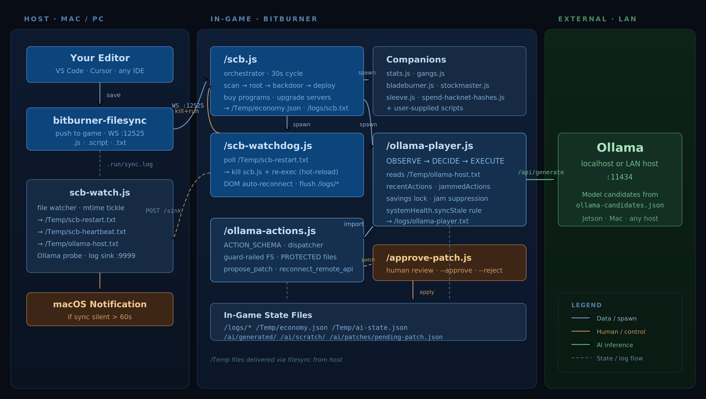

# scb — Bitburner SCB Orchestrator + Ollama AI Player

A modular automation stack for [Bitburner](https://bitburner-official.github.io/), with an autonomous AI player that uses **Ollama** (local or self-hosted LAN) — or optionally Claude — to make decisions, and a guard‑railed file‑system surface so the model can extend itself without bricking your save.

[](https://buymeacoffee.com/jcinc)


> 👋 Built by a disabled veteran in the gaps between appointments. If `scb` saves you time, a ⭐ on the repo is free and is the single most useful thing you can do. A [coffee or pizza](https://buymeacoffee.com/jcinc) keeps the commits coming. The AI player remains unimpressed by your generosity — I am not.



---

## Quick start

```sh
git clone https://github.com/Subzero121800/BitBurner-AI.git
cd BitBurner-AI
chmod +x scb.sh

# Install Ollama somewhere reachable, then pull a model
ollama serve &                       # local default — see Config section for LAN
ollama pull deepseek-coder-v2:16b    # or llama3.1:8b for low-RAM hosts

./scb.sh start                       # filesync :12525 + scb-watch (Ollama probe)
```

Then in **Bitburner**:

1. *Options → Remote API → Connect* (and tick *Auto‑connect on Start*)
2. In the in-game terminal: `run scb.js`

You should see `INFO  ollamaHost: http://...` print in the player's tail. From here, every save to `scb.js` / `ollama-player.js` / `ollama-actions.js` hot‑reloads the orchestrator within ~3 seconds.

---

<details>
<summary><strong>📺 Screenshots</strong> — what it looks like running</summary>
<br>

Orchestrator + AI player picking real actions in real time:


`/scb-watchdog.js` riding through Remote API connect/disconnect cycles while the orchestrator keeps backdooring servers in parallel:


The safety policy doing its job — model wanted to upgrade a server, cash-reserve check rejected it cleanly without crashing the loop:


</details>

---

## ⚙️ Configuring the AI backend

The system supports two backends. **Ollama is the default** — fully local or LAN-hosted, no API key. **Claude** is opt-in via the local CLI.

<details>
<summary><strong>Ollama — local install (simplest)</strong></summary>
<br>

If Ollama is running on the same Mac that runs `scb.sh`, **no configuration is needed**. `scb-watch` probes `http://127.0.0.1:11434` on startup and every 5 minutes, and writes the discovered host to `/Temp/ollama-host.txt`. The in-game player reads that file every cycle.

```sh
brew install ollama        # or your platform's installer
ollama serve &
ollama pull deepseek-coder-v2:16b
```

To change which model the player uses, edit [`scb.js`](scb.js):

```js
const AI_CONFIG = {
  backend:      "ollama",
  ollamaModel:  "deepseek-coder-v2:16b",   // ← change me
  // ...
};
```

Save → the watchdog hot-reloads scb.js → player respawns with the new model.

</details>

<details>
<summary><strong>Ollama — self-hosted on LAN (Jetson, GPU box, server)</strong></summary>
<br>

If your Ollama lives on a different machine (e.g. a Jetson, a dedicated GPU server, or another Mac on your LAN), drop a JSON array into `watch/ollama-candidates.json`:

```json
[
  "http://127.0.0.1:11434",
  "http://10.0.0.42:11434",
  "http://192.168.1.50:11434"
]
```

That file is **gitignored** — your network topology stays out of source control. A starter template lives at [`watch/ollama-candidates.example.json`](watch/ollama-candidates.example.json).

`scb-watch` probes them in order. The **first one to respond** to `GET /api/tags` wins and gets written to `/Temp/ollama-host.txt`. The in-game player picks it up automatically — no in-game config needed.

If the chosen host goes offline mid-session, scb-watch re-probes every 5 minutes and falls through to the next candidate. So you can run "primary GPU box + fallback CPU box" for resilience.

**Make sure Ollama is reachable from your Mac:**

```sh
# On the Ollama host:
OLLAMA_HOST=0.0.0.0:11434 ollama serve   # bind to LAN, not localhost-only

# From your Mac:
curl http://<ollama-host>:11434/api/tags  # should return JSON listing pulled models
```

If `curl` works but `scb-watch` doesn't pick it up, check `tail -f .run/watch.log` — it logs `ollama detected: ...` on success and `no candidate reachable` on failure.

**Choosing a model size:**

| Model                    | Roughly       | Good for                                           |
|--------------------------|---------------|----------------------------------------------------|
| `llama3.1:8b`            | 5 GB VRAM     | Low-RAM Macs / older GPUs. Won't propose patches reliably. |
| `deepseek-coder-v2:16b`  | 9 GB VRAM     | **Recommended default.** Reads source, emits propose_patch coherently. |
| `qwen2.5-coder:32b`      | 19 GB VRAM    | Better code reasoning. Needs a serious GPU.        |
| `llama3.1:70b`           | 40 GB VRAM    | Best quality on consumer hardware. Multi-GPU helpful. |

Set the chosen model in `AI_CONFIG.ollamaModel` in `scb.js`.

</details>

<details>
<summary><strong>Claude (opt-in) — via local Claude Code CLI</strong></summary>
<br>

If you'd rather use Claude as the backend, the project ships a tiny opt-in HTTP shim ([`bridge/claude-bridge.js`](bridge/claude-bridge.js)) that shells out to your local `claude` CLI. **It inherits whatever auth Claude Code is using** — Pro/Max plan or `ANTHROPIC_API_KEY` — so no key needs to live in this repo.

```sh
# 1. Make sure the CLI works
claude --version

# 2. Start the bridge (NOT auto-started by scb.sh start)
./scb.sh bridge
```

Then flip the backend in [`scb.js`](scb.js):

```js
const AI_CONFIG = {
  backend:      "claude",
  claudeHost:   "http://localhost:3000",
  claudeModel:  "sonnet",                  // "sonnet" | "opus" | "haiku" | full id
  // ...
};
```

Optional: customize via [`bridge/.env`](bridge/.env.example):

| Var                 | Default | Effect                                       |
|---------------------|---------|----------------------------------------------|
| `PORT`              | `3000`  | Bridge HTTP port                             |
| `CLAUDE_BIN`        | `claude`| Path override (for nvm/asdf/non-default installs) |
| `CLAUDE_MODEL`      | (CLI default) | Passed via `claude --model`           |
| `CLAUDE_TIMEOUT_MS` | `90000` | Per-request timeout                          |

The bridge is **localhost-only** and **opt-in** — `./scb.sh start` doesn't launch it. Stop with `./scb.sh stop` (kills all services) or kill the pid in `.run/bridge.pid`.

</details>

<details>
<summary><strong>All <code>AI_CONFIG</code> fields explained</strong></summary>
<br>

Defined in [`scb.js`](scb.js); passed to `/ollama-player.js` as a JSON arg every spawn.

| Field            | Default                            | What it does                                                        |
|------------------|------------------------------------|---------------------------------------------------------------------|
| `backend`        | `"ollama"`                         | `"ollama"` or `"claude"`                                            |
| `ollamaHost`     | `"http://127.0.0.1:11434"`         | Fallback if `/Temp/ollama-host.txt` is empty/missing                |
| `ollamaModel`    | `"deepseek-coder-v2:16b"`          | Model passed to `/api/generate`                                     |
| `claudeHost`     | `"http://localhost:3000"`          | Bridge endpoint when `backend === "claude"`                         |
| `claudeModel`    | `"sonnet"`                         | Sonnet / opus / haiku / full model id                               |
| `pollInterval`   | `300_000` (5 min)                  | How often the AI cycle fires. Lower = more reactive + more inference cost |
| `timeoutMs`      | `90_000`                           | Per-call timeout. 16B models can run 30–60 s on consumer hardware.  |
| `temperature`    | `0.2`                              | Ollama sampling temperature. Low = deterministic.                   |
| `numCtx`         | `8192`                             | Ollama context window. Increase if recentActions gets truncated.    |
| `recentLogLines` | `30`                               | How many log lines feed back as `state.recentActions`               |
| `jamThreshold`   | `3`                                | Identical-failure count before `REPEAT-SUPPRESSED` server-side       |

</details>

---

## 💾 RAM cost & limiting in-game memory

> Real talk on the in-game RAM footprint, since this got asked on r/Bitburner.

<details>
<summary><strong><code>FLAGS.maxInGameRamGB</code> — the soft cap (recommended)</strong></summary>
<br>

There's a single configurable knob that caps how much **home** RAM the system is allowed to consume across everything it spawns (companions, AI player, auto-generated workers). `scb.js` itself is exempt — without it, nothing else can launch.

Edit [`scb.js`](scb.js):

```js
const FLAGS = {
  // ...
  // 0 = unlimited; otherwise budget cap in GB.
  maxInGameRamGB: 32,   // ← e.g. cap at 32 GB
  // ...
};
```

When the cap is set, `ensureRunning` checks each launch against the running total. Anything that would push past the cap is **skipped with a clear log line**:

```
WARN  skipping /bladeburner-manager.js — would exceed maxInGameRamGB=32 (cost 16.0 GB, used 26.4 GB)
```

The budget is also published to `/Temp/economy.json` and surfaced in the AI player's prompt as `state.budget`. When `state.budget.tight` is true, the model is told to stop proposing actions that spawn new home-side scripts and pick income actions that use existing capacity instead.

**Suggested values:**

| Home RAM     | Recommended `maxInGameRamGB` | What you get                                                           |
|--------------|------------------------------|------------------------------------------------------------------------|
| 32 GB        | `16`                         | Orchestrator + watchdog only. Pure automation, no AI.                  |
| 64 GB        | `32`                         | Add the AI player + auto-contracts.                                    |
| 128 GB       | `64`                         | Add one heavy companion (gang-manager OR bladeburner-manager).         |
| 256 GB+      | `0` (unlimited)              | Full stack.                                                            |

Default is `0` (unlimited) — no behavior change unless you opt in.

</details>

<details>
<summary><strong>Approximate RAM cost on <code>home</code></strong></summary>
<br>

Bitburner charges static RAM per-script based on which `ns.*` API surfaces a script imports. Approximate costs:

| Script                       | Static RAM | What drives the cost                                |
|------------------------------|------------|-----------------------------------------------------|
| `scb.js` (orchestrator)      | ~24 GB     | Singularity (purchase, backdoor), `ns.cloud.*`, scan |
| `ollama-player.js`           | ~8 GB      | Singularity work/study/gym/crime, sleeve, gang, bladeburner |
| `ollama-actions.js` (lib)    | ~0 GB      | Pure dispatcher; cost charged where called          |
| `scb-watchdog.js`            | ~2 GB      | `ns.exec`, `ns.kill`, `ns.write`                    |
| `gang-manager.js`            | ~16 GB     | `ns.gang.*` is RAM-heavy                            |
| `bladeburner-manager.js`     | ~16 GB     | `ns.bladeburner.*` is RAM-heavy                     |
| `hack/grow/weaken.js`        | ~1.7 GB ea | Run on worker servers, not home                     |

**Total core (orchestrator + watchdog only): ~26 GB.** Add the AI player: **~34 GB.** Add gang + bladeburner managers: **~66 GB.**

Measure exact cost in-game: `getScriptRam("scb.js")` from another script, or check the RAM indicator in `nano`.

</details>

<details>
<summary><strong>Manual low-RAM setup (alternative to <code>maxInGameRamGB</code>)</strong></summary>
<br>

If you'd rather flip features individually instead of using the budget cap, [`scb.js`](scb.js)'s `FLAGS` lets you turn each one off:

```js
const FLAGS = {
  // Core (cheap, leave on)
  scanAndRoot:       true,
  backdoor:          true,
  buyTor:            true,
  buyPrograms:       true,
  serverUpgrader:    true,
  deployHackScripts: true,
  autoContracts:     true,
  watchdog:          true,

  // Disable until you have headroom
  ollamaPlayer:      false,            // ← ~8 GB saved
  launchCompanions:  false,            // ← ~32 GB saved if you ran both managers
  companions:        {}
};
```

Or keep companions on but enable them one at a time:

```js
launchCompanions: true,
companions: {
  "gang-manager.js":            true,    // 16 GB — only after you're in a gang
  "bladeburner-manager.js":     false,   // 16 GB — only after Bladeburner stats hit 100
}
```

`maxInGameRamGB` and per-flag toggles compose: even with `launchCompanions: true`, anything that exceeds the budget is silently skipped with a `WARN` log.

</details>

---

<details>
<summary><strong>🛡️ Safety / economy policy</strong></summary>
<br>

Configured in `SAFETY` in [`scb.js`](scb.js). Every cycle, scb.js publishes the live policy to `/Temp/economy.json` so other in-game scripts (the upgrader, future helpers) honor the same numbers.

| Setting                  | Default     | Effect                                                                                                    |
|--------------------------|-------------|-----------------------------------------------------------------------------------------------------------|
| `maxActionsPerCycle`     | `5`         | Hard cap on actions per AI cycle.                                                                         |
| `minCashReserve`         | `$1M`       | **Hard floor.** Any action that would drop liquid home cash below this is rejected.                       |
| `savingsTarget`          | `$100M`     | **Soft target.** While cash &lt; (`minCashReserve` + `savingsTarget`), discretionary spending is paused.  |
| `cashSpendCapPct`        | `90`        | Once savings unlocked, per-cycle spend ceiling as a % of starting-cycle cash.                             |
| `minAugsToInstall`       | `5`         | `install_augmentations` rejected if fewer than this many are queued.                                      |
| `requireConfirmForReset` | `true`      | Blocks `install_augmentations` / `soft_reset` unless `/Temp/ai-confirm-reset.txt` exists.                 |
| `blockedActions`         | `["soft_reset"]` | Hard deny list.                                                                                      |
| `logAllActions`          | `true`      | Gates `/logs/ollama-player.txt` writes. Required for jam suppression to work.                             |

**How savings works:** discretionary actions (`buy_program`, `buy_server`, `upgrade_server`, `buy_augmentation`, `donate_faction`) get rejected with `SAVINGS-LOCKED: cash is $X short of savings target ($Y)` whenever the threshold isn't met. Income-generating actions still run. Once cash crosses the threshold the lock dissolves until a big spend drains it — then it re-locks.

**Repeat-suppression:** the `safetyCheck` validator computes `state.jammedActions` from the recent log. Any proposal whose JSON matches a jammed signature gets rejected with `REPEAT-SUPPRESSED (Nx): identical action just failed — try a different approach`. The rejection text goes back into the next cycle's `recentActions`, so even a stubborn model gets the message.

</details>

<details>
<summary><strong>📁 AI filesystem & process actions (guard-railed)</strong></summary>
<br>

The AI exposes a sandboxed surface via `/ollama-actions.js` so the model can write its own helper scripts and run them without touching the orchestrator core.

| Action                    | Effect                                                                              |
|---------------------------|-------------------------------------------------------------------------------------|
| `read_file`               | Read any file (no path restriction). Result truncated at 4 KB.                      |
| `list_files`              | List home-dir files, optionally prefix-filtered.                                    |
| `write_generated_script`  | Write content. Only to `/ai/generated/`, `/ai/scratch/`, `/Temp/`, `/logs/`.        |
| `delete_generated_script` | Delete a file in the same allowed dirs.                                             |
| `run_script`              | Exec a script that lives in an allowed dir on home or any rooted server.            |
| `kill_script`             | Kill all instances of a filename on a host (intentionally open — reversible).       |
| `copy_script`             | Copy from home (allowed dir) to a rooted server.                                    |
| `propose_patch`           | Write a patch proposal for a PROTECTED file → `/ai/patches/pending-patch.json`.     |
| `reconnect_remote_api`    | DOM walks Options → Remote API → Connect. Used when sync goes stale.                |

**Path traversal:** `..` collapsed before allowlist check. The AI cannot escape `/ai/generated/` via `/ai/generated/../scb.js`.

**Protected files** (cannot be written / deleted / exec'd by the AI directly):

```
scb.js                ollama-actions.js     scb-watchdog.js
ollama-player.js      contractor.js         server-upgrader.js
hack.js  grow.js  weaken.js  helpers.js  autopilot.js
```

To change one, the AI emits a `propose_patch` action. Proposal lands in `/ai/patches/pending-patch.json`, you get a toast, and review with:

```
home / $ run /approve-patch.js              # show pending proposal
home / $ run /approve-patch.js --approve    # apply (snapshot saved)
home / $ run /approve-patch.js --discard    # reject
home / $ run /approve-patch.js --list       # show history
```

Applied patches are archived to `/ai/patches/applied-<ts>.json` for manual rollback.

</details>

<details>
<summary><strong>🔁 Hot-reload + observability</strong></summary>
<br>

```
edit + save  →  scb-watch (host)  →  /Temp/scb-restart.txt  →  filesync  →  game
                                                                              │
                                                            /scb-watchdog.js ←┘
                                                            kills + re-execs scb.js
```

Watched files: `scb.js`, `ollama-player.js`, `ollama-actions.js`. Editing `bridge/claude-bridge.js` or `bridge/.env` instead bounces the local bridge process directly (no in-game restart).

The watcher also writes `/Temp/scb-heartbeat.txt` every 2 s. The in-game watchdog flags Remote API as offline if the heartbeat goes older than 15 s.

**Persistent logs** — disk-backed history of what the orchestrator and AI did:

| In-game file              | Source              | Contents                                                          |
|---------------------------|---------------------|-------------------------------------------------------------------|
| `/logs/scb.txt`           | `scb.js`            | One CYCLE line per orchestrator pass                              |
| `/logs/ollama-player.txt` | `ollama-player.js`  | `OK`/`SKIP`/`FAIL` per action with full context                   |
| `/logs/gang.txt`          | `gang-manager.js`   | Recruit / task / ascend / equip events                            |
| `/logs/bladeburner.txt`   | `bladeburner-manager.js` | Action selection, skill purchases                            |

(`.txt` rather than `.log` so the in-game `download <file>` command accepts them.)

Both rotate at ~256 KB. Every 30 s the in-game watchdog POSTs new content (cursor-based, only the bytes since last push) to the local sink (`http://127.0.0.1:9999/sink/<name>`):

```sh
tail -f .run/game-scb.log              # orchestrator cycle history (host-side)
tail -f .run/game-ollama-player.log    # AI action stream (host-side)
tail -f .run/game-gang.log             # gang manager
tail -f .run/game-bladeburner.log      # bladeburner manager
```

Ad-hoc pulls work via the in-game terminal: `download /logs/scb.txt`.

**Self-context loop:** `buildGameState` injects the last 30 lines of `/logs/ollama-player.txt` as `state.recentActions` so the model can see what it just did and avoid the "try the same forbidden upgrade 50 times in a row" failure mode. `state.jammedActions` lists `(action, reason)` pairs that failed 3+ times in a row — the prompt instructs the model to abandon them, and `safetyCheck` enforces it server-side.

</details>

<details>
<summary><strong>🧰 Commands reference</strong></summary>
<br>

**Host-side (`./scb.sh`):**

| Command         | Effect                                                          |
|-----------------|-----------------------------------------------------------------|
| `start`         | filesync + scb-watch (NOT bridge)                               |
| `stop`          | All services (including bridge if running)                      |
| `restart`       | stop everything, then start filesync + watch                    |
| `status`        | Show running pids                                               |
| `logs`          | Tail all log files                                              |
| `sync`          | Only filesync                                                   |
| `bridge`        | Only the Claude bridge (opt-in)                                 |
| `watch`         | Only the file watcher                                           |
| `sync-all`      | Touch every `.js`/`.script`/`.txt` so filesync re-pushes them   |

**In-game terminal:**

```
run scb.js                                         # start the orchestrator
run scb.js --cleanup                               # archive deprecated scripts
run /approve-patch.js [--approve|--discard|--list] # AI patch review
run /ollama-actions.js --list                      # dump the action schema
```

</details>

<details>
<summary><strong>🛠️ Troubleshooting</strong></summary>
<br>

| Symptom                                          | Fix                                                                                          |
|--------------------------------------------------|----------------------------------------------------------------------------------------------|
| Hot-reload not firing                            | `tail -f .run/watch.log`. If you see `restart-marker bumped` but the game doesn't react, `kill /scb-watchdog.js && run /scb-watchdog.js`. |
| "Remote API offline" toast                       | Click *Connect* in the in-game panel. If it auto-disconnects repeatedly, `./scb.sh restart`. |
| Player spamming `fetch failed` warnings          | scb-watch hasn't found a reachable Ollama. Check `cat Temp/ollama-host.txt`.                  |
| Filesync `connected` but files not pushing       | Editor wrote via atomic-rename; chokidar can drop those events. `./scb.sh sync-all` re-pushes. |
| AI proposes same action 5+ times in a row        | The `recentActions` window is empty (likely `logAllActions: false`) — re-enable it.          |
| Bitburner says "X cannot be run because it does not have a main function" | You ran a library directly. `ollama-actions.js` has a stub `main` that prints help. |
| Bridge never starts                              | `claude --version` must work. If you use nvm/asdf, set `CLAUDE_BIN=/abs/path/to/claude` in `bridge/.env`. |

</details>

<details>
<summary><strong>📋 Requirements & Source-File gating</strong></summary>
<br>

**Required to run anything in this repo:**

* **Bitburner 3.0.0+** — uses `ns.cloud.*`, `ns.ui.openTail`, etc.
* **Source-File 4** (Singularity) — at any level. The orchestrator (`scb.js`) cannot start without it: it calls `ns.singularity.*` to buy the TOR router + port crackers, install backdoors, and execute every `work_*` / `study` / `gym` / `commit_crime` / `install_augmentations` / `soft_reset` / `travel` / `connect` / `buy_program` / `buy_augmentation` / `donate_faction` action.
* **Node ≥ 18** on the host (zero npm deps — pure stdlib).
* **Ollama** running somewhere reachable, OR `claude` CLI on PATH for the Claude-bridge backend.

**Optional Source-Files — features that gracefully no-op without them:**

| Source-File               | Gates              | Affected components                                                                          |
|---------------------------|--------------------|----------------------------------------------------------------------------------------------|
| **SF-2** (Gangs)          | `ns.gang.*`        | `gang-manager.js` idles cleanly. AI's `gang_recruit` / `gang_assign` / `gang_ascend` throw.  |
| **SF-6** (Bladeburners)   | `ns.bladeburner.*` | `bladeburner-manager.js` idles cleanly. AI's `bb_action` / `bb_skill` throw.                 |
| **SF-10** (Sleeves)       | `ns.sleeve.*`      | AI's `sleeve_task` action only. Other features unaffected.                                   |
| **SF-13** (Stanek's Gift) | `ns.stanek.*`      | Stanek companion only. `scb.js` auto-skips Stanek-dependent companions if Gift not accepted. |

On a fresh BN-1 install you have **none** of the optional SFs — disable the gang + bladeburner managers in `scb.js`:

```js
// scb.js
const FLAGS = {
  // ...
  companions: {
    "gang-manager.js":            false,   // needs SF-2
    "bladeburner-manager.js":     false,   // needs SF-6
    // ...
  }
};
```

The AI player itself runs without SF-2/6/10 — it just won't propose those gated actions in practice once it sees them rejected once.

</details>

---

## ☕ Support

I'm a disabled veteran who ships open-source projects in the gaps between appointments. If `scb` saved you some hours, sparked an idea you ran with, or just made you laugh once while tailing the logs —

* ⭐ **Star the repo.** Free, one click, genuinely the single most useful thing you can do. More stars = more Bitburner players find it.
* ☕ **[Buy me a coffee](https://buymeacoffee.com/jcinc)** — one-off, or a recurring membership if you really want to kit me out. Memberships fund the un-shippable work: safety audits, refactors, more model backends, more guard rails.
* 🍕 Buy enough coffees and I will absolutely upgrade one to a pizza. My dog will help eat it.

None of this is expected. The AI player keeps running either way. If you got genuine value out of this repo, a few seconds (the star) or a few bucks (the coffee) goes a long way. Either way — thanks for being here.

[](https://buymeacoffee.com/jcinc)

---

## License

MIT — see [LICENSE](LICENSE).
