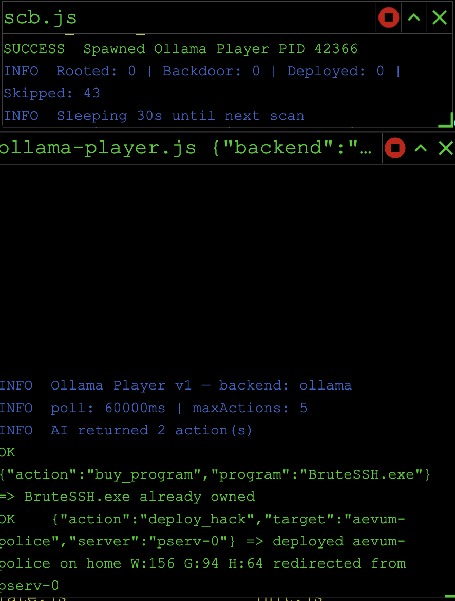
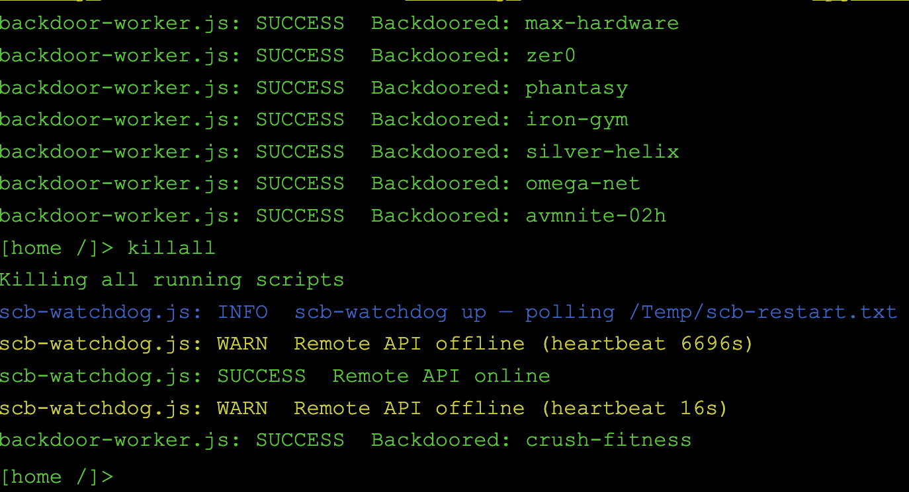
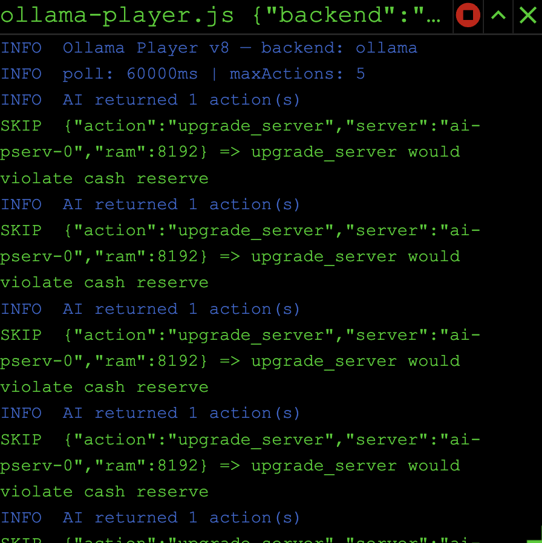

# scb — Bitburner SCB Orchestrator + Ollama AI Player

A modular automation stack for [Bitburner](https://bitburner-official.github.io/), with an autonomous AI player that uses **Ollama** (local or LAN) to make decisions and a guard‑railed file‑system surface so the model can extend itself without bricking your save.

```
┌───────────────────────────┐    save     ┌──────────────────────┐    WS :12525    ┌──────────────────┐
│  your editor / VS Code    │ ──────────▶ │  bitburner-filesync  │ ──────────────▶ │  Bitburner game  │
└───────────────────────────┘             └──────────────────────┘                 └──────────────────┘
                                                  ▲                                          │
                                                  │ /Temp/scb-restart.txt                    │
                                                  │ /Temp/ollama-host.txt                    │
                                                  │ /Temp/scb-heartbeat.txt                  │
                                          ┌───────┴──────────┐                               │
                                          │   scb-watch.js   │ ◀───────── status, logs ──────┘
                                          │  (file watcher,  │
                                          │   Ollama probe,  │             ┌────────────────────────┐
                                          │   bridge restart)│             │   /scb.js              │
                                          └──────────────────┘             │     ↓                  │
                                                  │                        │   /scb-watchdog.js     │ ──── hot-reload scb.js
                                                  │                        │   /ollama-player.js    │ ──── HTTP ──▶ Ollama @ LAN
                                                  ▼                        │   /ollama-actions.js   │
                                          /Temp/ollama-host.txt            │   /approve-patch.js    │ ──── human review of AI patches
                                                                           └────────────────────────┘
```

---

## See it in action

Orchestrator + AI player picking real actions in real time:



`/scb-watchdog.js` riding through Remote API connect/disconnect cycles while the orchestrator keeps backdooring servers in parallel:



The safety policy doing its job — model wanted to upgrade a server, cash-reserve check rejected it cleanly without crashing the loop:



---

## What it does

* **Roots, backdoors, and deploys hack/grow/weaken** to every reachable server every 30 s.
* **Auto-buys** TOR + port-cracker programs as soon as they're affordable.
* **Auto-solves coding contracts** via an embedded contractor template.
* **Hot-reloads** the running orchestrator the moment you save a watched source file — no `kill scb.js && run scb.js` dance.
* **Detects the Remote API** going offline and surfaces a toast (with a best-effort DOM-click of *Connect*).
* **Runs an autonomous AI player** that reads game state every 60 s, asks an Ollama model what to do, and executes the response under a strict safety policy.
* **Lets the AI write its own scripts** under `/ai/generated/`, run them, copy them to rooted servers, and propose patches to protected files for human approval.

It deliberately ships small. There's no Bryden / Insight framework here — you bring your own companions if you want them.

---

## Repo layout

```
scb.js                 — Master orchestrator (in-game entry point)
ollama-player.js       — Autonomous AI player loop (OBSERVE → DECIDE → EXECUTE)
ollama-actions.js      — Action library + dispatcher + safety guards
scb-watchdog.js        — In-game hot-reload daemon + Remote-API watchdog
approve-patch.js       — Human-in-the-loop reviewer for AI-proposed patches

hack.js / grow.js
  / weaken.js          — Single-loop workers spawned by deploy_hack

scb.sh                 — Local-services launcher (filesync + watch + opt-in bridge)
bitburner-filesync.json — filesync config (port 12525, .js/.script/.txt)

watch/scb-watch.js     — Local Node daemon: file watcher, hot-reload trigger,
                         heartbeat writer, Ollama-host prober. Zero deps.
bridge/                — OPTIONAL Claude Code CLI bridge for use as an AI
                         backend instead of Ollama. Off by default.

ai/generated/          — AI-authored scripts land here (allowlisted for write+run)
ai/scratch/            — Scratch space for AI experiments (allowlisted)
ai/patches/            — Pending + applied patch proposals for protected files
logs/                  — Allowlisted dump space for AI-emitted logs
```

---

## Quick start

### 1. Install Ollama

Anywhere reachable from the Mac running scb. By default the watcher only
probes `http://127.0.0.1:11434` (local install). To include LAN endpoints
(a Jetson, a dedicated GPU box, etc.), drop a JSON array into
`watch/ollama-candidates.json`:

```json
[
  "http://127.0.0.1:11434",
  "http://10.0.0.42:11434"
]
```

That file is gitignored — your network topology stays out of source control.
A starter template lives at [`watch/ollama-candidates.example.json`](watch/ollama-candidates.example.json).

```sh
# local install
brew install ollama       # or your platform's equivalent
ollama serve &
ollama pull llama3.1:8b
```

### 2. Bring up the local services

```sh
./scb.sh start          # filesync :12525 + scb-watch (Ollama probe)
./scb.sh status         # see what's running
./scb.sh logs           # tail all log files
```

The Claude bridge is **opt-in** — `start` doesn't launch it. If you want Claude as the AI backend instead of Ollama:

```sh
./scb.sh bridge         # starts bridge :3000 (requires `claude` on PATH)
# then flip AI_CONFIG.backend = "claude" in scb.js
```

### 3. Connect the game

In Bitburner: *Options → Remote API → Connect*. The status flips to **Online** and `.run/sync.log` shows `Connection made!`. Optional but recommended: enable *Auto-connect on Start* in the same panel.

### 4. Run the orchestrator

In the in-game terminal:

```
home / $ run scb.js
```

You'll see:
* `SUCCESS  Spawned scb-watchdog (PID …)` — hot-reload is armed
* `SUCCESS  Spawned Ollama Player (PID …)` — assuming `FLAGS.ollamaPlayer = true`
* The player log: `INFO  ollamaHost: http://127.0.0.1:11434` (or whichever endpoint is up)

From here, save any of `scb.js` / `ollama-player.js` / `ollama-actions.js` in your editor and the in-game watchdog will kill + re-launch `scb.js` within a second or two.

---

## The AI player

`/ollama-player.js` runs an OBSERVE → DECIDE → EXECUTE loop on a configurable interval (default 60 s). Each cycle:

1. **Observe** — snapshot money, hack level, server fleet, faction state, etc. into a JSON game state. Cap ~5–10 KB.
2. **Decide** — POST the state + system prompt to whichever Ollama endpoint scb-watch flagged as reachable. Falls through to `ns.wget` if `fetch` is blocked.
3. **Execute** — run up to `safety.maxActionsPerCycle` actions in order, gating each on per-action validators and the global safety policy.

### Safety policy

Configured in `SAFETY` in [`scb.js`](scb.js):

| Setting                  | Default     | Effect                                                                      |
|--------------------------|-------------|-----------------------------------------------------------------------------|
| `maxActionsPerCycle`     | 5           | Hard cap on actions per OBSERVE cycle.                                      |
| `minCashReserve`         | $1M         | Player skips spending actions that would drop home cash below this.         |
| `cashSpendCapPct`        | 90          | Per-cycle spend cap, expressed as a % of starting cash.                     |
| `minAugsToInstall`       | 5           | `install_augmentations` is rejected if fewer than this many are queued.     |
| `requireConfirmForReset` | true        | Blocks `install_augmentations` / `soft_reset` unless `/Temp/ai-confirm-reset.txt` exists. |
| `blockedActions`         | `["soft_reset"]` | Hard deny list — outright rejected before validation.                  |

**Kill switch**: write any content to `/Temp/ollama-player-stop.txt` — the player exits cleanly on its next cycle.

---

## AI filesystem access (guard-railed)

The player exposes a sandboxed surface so the model can write and run its own helpers without touching the orchestrator core.

| Action                    | What it does                                                                     |
|---------------------------|----------------------------------------------------------------------------------|
| `read_file`               | Read any file (no path restrictions). Result truncated at 4 KB.                  |
| `list_files`              | List home-dir files, optionally prefix-filtered.                                 |
| `write_generated_script`  | Write content. **Only** under `/ai/generated/`, `/ai/scratch/`, `/Temp/`, `/logs/`. |
| `delete_generated_script` | Delete a file in the same allowed dirs.                                          |
| `run_script`              | Exec a script that lives in an allowed dir on `home` or any rooted server.       |
| `kill_script`             | Kill all instances of a filename on a host (intentionally open — reversible).    |
| `copy_script`             | Copy from `home` (allowed dir) to a rooted server.                               |
| `propose_patch`           | Write a patch proposal for a PROTECTED file → `/ai/patches/pending-patch.json`.  |

### Path traversal

Paths are normalized (`..` collapsed, `//` collapsed, leading `/` enforced) **before** the allowlist check. The AI cannot escape `/ai/generated/` via `/ai/generated/../scb.js`.

### Protected files

Direct write / delete / exec is rejected for:

```
scb.js              ollama-actions.js     scb-watchdog.js
ollama-player.js    contractor.js         server-upgrader.js
hack.js  grow.js  weaken.js  helpers.js  autopilot.js
```

To change one of these, the AI emits a `propose_patch` action. The proposal lands in `/ai/patches/pending-patch.json` and a toast asks for review:

```
home / $ run /approve-patch.js              # show the pending proposal
home / $ run /approve-patch.js --approve    # apply it (snapshots target first)
home / $ run /approve-patch.js --discard    # reject and remove
home / $ run /approve-patch.js --list       # show proposal + apply log
```

Applied patches are archived to `/ai/patches/applied-<ts>.json` so a manual rollback is always one `nano` away.

---

## Hot-reload flow

```
edit + save  ──▶  scb-watch (local)  ──▶  /Temp/scb-restart.txt  ──▶  filesync  ──▶  game
                                                                                       │
                                                                  /scb-watchdog.js  ◀──┘
                                                                  kills + re-execs scb.js
```

Watched files: `scb.js`, `ollama-player.js`, `ollama-actions.js`. Editing `bridge/claude-bridge.js` or `bridge/.env` instead bounces the local bridge process directly (no in-game restart).

The watcher also writes `/Temp/scb-heartbeat.txt` every 2 s. The in-game watchdog flags Remote API as offline if the heartbeat goes older than 15 s, surfaces a `ns.toast`, and best-effort clicks the *Connect* button via `globalThis.document` (works only when the panel is open).

---

## Backends

| Backend  | Default? | How to enable                                                                      |
|----------|----------|------------------------------------------------------------------------------------|
| Ollama   | ✅       | `AI_CONFIG.backend = "ollama"` (default). Local or LAN endpoint auto-detected.    |
| Claude   | opt-in   | `./scb.sh bridge`, then `AI_CONFIG.backend = "claude"`. Requires `claude` on PATH. |

The Claude bridge ([`bridge/claude-bridge.js`](bridge/claude-bridge.js)) is a tiny pure-stdlib HTTP shim that shells out to `claude -p` for each `/generate` call. It inherits whatever auth Claude Code is using (Pro/Max plan, or `ANTHROPIC_API_KEY`) — no key in this repo.

---

## Commands

```sh
./scb.sh start         # filesync + scb-watch (NOT bridge)
./scb.sh stop          # stops all three services
./scb.sh restart       # stop everything, then start filesync + watch
./scb.sh status        # show running pids
./scb.sh logs          # tail all log files
./scb.sh sync          # only filesync
./scb.sh bridge        # only the Claude bridge (opt-in)
./scb.sh watch         # only the file watcher
./scb.sh sync-all      # touch every .js/.script/.txt → re-pushes them
```

In-game:

```
run scb.js                         # start the orchestrator
run scb.js --cleanup               # archive deprecated scripts to /Deprecated/
run /approve-patch.js [--approve|--discard|--list]
run /ollama-actions.js --list      # dump the action schema
```

---

## Requirements

* **Bitburner 3.0.0+** (the scripts use `ns.cloud.*`, `ns.ui.openTail`, etc.)
* **Source-File 4** (Singularity API) — `scb.js` calls `ns.singularity.*` for backdoor + program purchase.
* **Node ≥ 18** for the local services (zero npm deps — pure stdlib).
* **Ollama** running somewhere reachable, OR `claude` CLI on PATH if you flip to the Claude backend.

---

## Troubleshooting

| Symptom                                         | Fix                                                                                          |
|-------------------------------------------------|----------------------------------------------------------------------------------------------|
| Hot-reload not firing                           | `tail -f .run/watch.log`. If you see `restart-marker bumped` but the game doesn't react, check `ps` in-game and confirm `/scb-watchdog.js` is running. |
| "Remote API offline" toast                      | Click *Connect* in the in-game panel. If it auto-disconnects repeatedly, `./scb.sh restart`. |
| Player spamming `fetch failed` warnings         | scb-watch hasn't found a reachable Ollama. Verify with `cat Temp/ollama-host.txt`.            |
| `cannot be run because it does not have a main function` | You ran a library directly. `ollama-actions.js` has a stub `main` that prints help.   |
| Filesync `connected` but files not pushing      | Editor wrote via atomic-rename; chokidar can drop those events. `./scb.sh sync-all` re-pushes everything. |
| AI tries to write to a protected file           | Working as intended — it should emit `propose_patch` instead. Check `tail -f .run/watch.log` and the in-game player tail for the rejection. |

---

## License

MIT — see [LICENSE](LICENSE).
